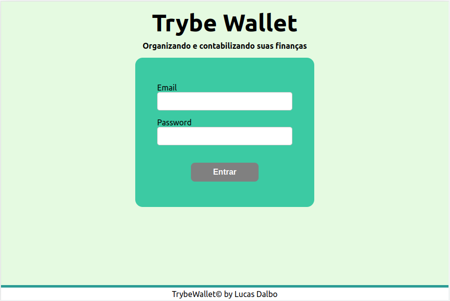
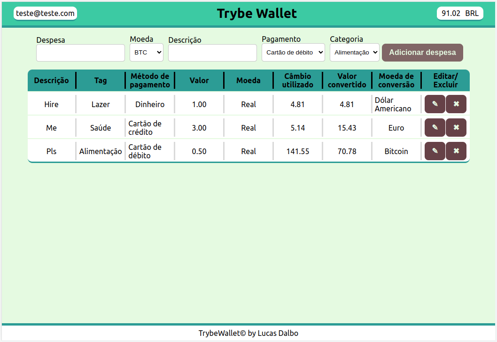

# Music App - Trybetunes

## What is this project?
TrybeWallet is a project that I made as a student of the Trybe Web Development School!

---

## What was used:
  -  React;
  -  React Router;
  -  Redux;
  -  Redux Thunk.

## In this App you can:
  -  In the Login page, you must type an email and a password to enter;
  -  In the Wallet page, you can add expenses;
  -  You can edit an expense, changing everything you want;
  -  You can delete an expense.

---

## Lint
The project was developed following the Clean Code standards specified by Trybe's Lint rules.

For installation and more information [click here](https://github.com/betrybe/eslint-config-trybe).

---

## Preview
| Login | Wallet |
| --- | --- |
|  |  | 

